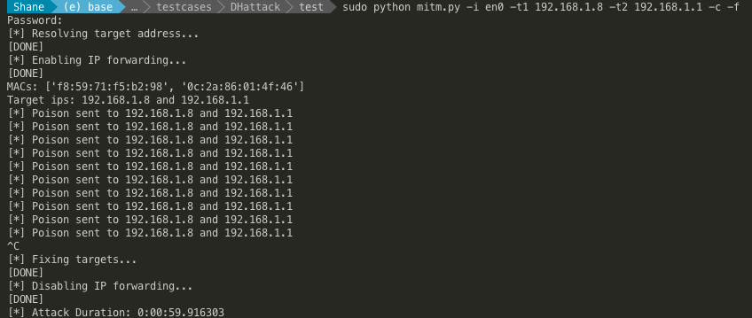
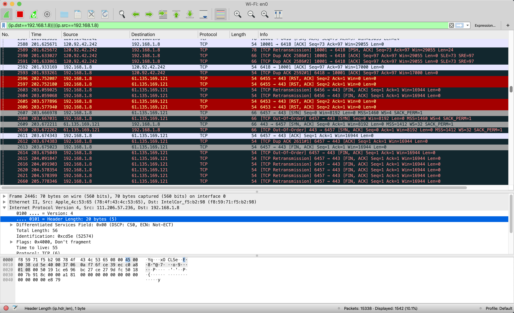

# IKEv2-mitm-attack

A simple tool for performing Man-In-The-Middle(MITM) attack on Internet Key Exchange version 2 protocal(IKEv2) based on python library `scapy`.

## Dependencies

`python >= 3.6`

`scapy`

`argparse`

## Usage

- Show explicit usage information by run `python mitm.py -h` in terminal.

- `-i` designate network interface to attack with(eg:`en0` is default port in Mac)

- `-t1` designate first target to spoof

- `-t2` designate second target to spoof which is actual `t1`'s communication target

- `-f` enable IP forwarding(Linux only)

- `-q` disable feedback messages

- `-c` traces attack duration

##### Example:

> python mitm.py -i en0 -t1 192.168.1.8 -t2 192.168.1.1 -f -q -c

##### Output:

## Validation

I monitor network activities through **Wireshark**, which gives me the result as screenshot pictured below:

The result shows that we have become MITM between `196.168.1.2` and `192.168.1.1`, which grants us the access to their communication information. Furthurmore, we may be able to decrypt the information we captured and change or delete what we want in it.

## More

If you are looking for more about MITM, [Bettercap](https://github.com/bettercap/bettercap) is an easy to use, all-in-one solution with all the features they might possibly need for performing reconnaissance and attacking [WiFi](https://www.bettercap.org/modules/wifi/) networks, [Bluetooth Low Energy](https://www.bettercap.org/modules/ble/) devices, wireless [HID](https://www.bettercap.org/modules/hid/) devices and [Ethernet](https://www.bettercap.org/modules/ethernet) networks.

## License

[MIT](https://github.com/freesinger/IKEv2-mitm-attack/blob/master/LICENSE)
